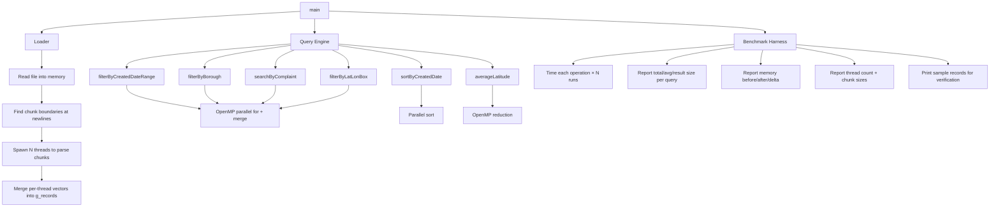

# Design Document: Multi-Threaded Service Requests

## Overview

This design parallelizes the existing single-threaded NYC 311 service request processing system. The single-threaded version loads ~14M records from a ~12GB CSV one line at a time and runs 6 queries on a big `vector<ServiceRequest>`. The multi-threaded version splits the work across multiple threads: divide the data into chunks, have each thread process its chunk, then combine the results.

We use two ways to do parallelism:
- **OpenMP** — for the query functions (filter, search, sort, average). Just add a `#pragma` and the compiler handles splitting the loop across threads.
- **std::thread** — for loading the CSV file, where we need to manually split the file into chunks at newline boundaries.

The `ServiceRequest` and `DateTime` structs are reused from `single_thread/`. The multi-threaded code lives in `multi_thread/main.cpp`, built with CMake.

### Design Decisions

1. **OpenMP for queries**: We use `#pragma omp parallel for` for the filter/search/aggregation queries. Each thread builds its own local results vector, then we merge them at the end. This is simpler than managing threads by hand.

2. **std::thread for CSV loading**: We read the whole file into a string, split it into chunks (one per thread), and each thread parses its chunk. We use `std::thread` here because we need to manually find newline boundaries so no line gets split between threads.

3. **Copy-then-sort for sorting**: We copy the global vector and sort the copy. For parallel sort we use `__gnu_parallel::sort` (GCC) or a simple parallel merge sort.

4. **Global g_records vector**: Same as the single-threaded version. Once loading is done, all queries just read from this vector — no locks needed during queries.

## Architecture



### Data Flow

1. **Load phase**: File → byte buffer → chunk boundaries → N threads parse CSV lines → N local vectors → merge into single `g_records`
2. **Query phase**: `g_records` (read-only) → OpenMP splits index range across threads → each thread builds local result vector → merge into output
3. **Benchmark phase**: Wraps load + each query in a timing loop, reports wall-clock times

## Components and Interfaces

### Loader Component

```cpp
// Parallel CSV loader — reads file, splits into chunks, spawns threads to parse
vector<ServiceRequest> loadDataParallel(string filename, int numberOfThreads);
```

**How it works**: 
1. Open the file and figure out how big it is
2. Read the whole file into one big string
3. Split that string into `numberOfThreads` roughly equal pieces
4. Adjust each split point forward to the next newline (so we don't cut a line in half)
5. Skip the header line in the first chunk
6. Spawn one `std::thread` per chunk — each thread loops through its lines, parses them with `parseCSVLine` and `ServiceRequest::fromFields`, and pushes results into its own local vector
7. After all threads finish (join), combine all the local vectors into one big result vector

### Query Engine Functions

All query functions take the thread count as a parameter.

```cpp
// Filter records by date range using OpenMP
vector<ServiceRequest> filterByCreatedDateRange(
    DateTime start, DateTime end, int numberOfThreads);

// Filter records by borough name (case-insensitive) using OpenMP
vector<ServiceRequest> filterByBorough(
    string borough, int numberOfThreads);

// Search complaint field for a keyword (case-insensitive) using OpenMP
vector<ServiceRequest> searchByComplaint(
    string keyword, int numberOfThreads);

// Filter records inside a lat/lon bounding box using OpenMP
vector<const ServiceRequest*> filterByLatLonBox(
    double minLat, double maxLat, double minLon, double maxLon, int numberOfThreads);

// Sort all records by createdDate using parallel sort
vector<ServiceRequest> sortByCreatedDate(int numberOfThreads);

// Compute average latitude using OpenMP reduction
double averageLatitude(int numberOfThreads);
```

### Parallel Filter Pattern (used by date range, borough, complaint, lat/lon)

```cpp
// How each parallel filter works (pseudocode):
//
// 1. Tell OpenMP how many threads to use:
//    omp_set_num_threads(numberOfThreads);
//
// 2. Make a separate results vector for each thread:
//    vector<vector<ServiceRequest>> localResults(numberOfThreads);
//
// 3. Loop through all records in parallel:
//    #pragma omp parallel for schedule(static)
//    for (int i = 0; i < g_records.size(); i++) {
//        int myThread = omp_get_thread_num();
//        if (recordMatchesFilter(g_records[i])) {
//            localResults[myThread].push_back(g_records[i]);
//        }
//    }
//
// 4. Merge all the local vectors into one result:
//    vector<ServiceRequest> finalResult;
//    for (int t = 0; t < numberOfThreads; t++) {
//        for (int j = 0; j < localResults[t].size(); j++) {
//            finalResult.push_back(localResults[t][j]);
//        }
//    }
```

No mutexes needed — each thread only writes to its own local vector.

### Benchmark Harness

The benchmark harness measures how long everything takes and how much memory is used. It works the same way as the single-threaded version so you can compare the numbers directly.

```cpp
// --- Memory tracking ---
// Before and after loading, call rssMemMB() to get current memory usage in MB.
// Print: memory before, memory after, and the difference.

// --- Data loading timing ---
// Use chrono::high_resolution_clock to time the loadDataParallel() call.
// Print: how long loading took, how many lines were processed, how many valid records.

// --- Query benchmarking ---
// Run each query 15 times in a simple for loop.
// For each query, track:
//   - The result size (from the first run)
//   - Total time across all 15 runs
//   - Average time per run (total / 15)

// --- Sample records ---
// Print the first 5 records after loading so you can eyeball them:
//   Format: #1: uniqueKey | createdDate | borough | complaintType

// --- Thread info ---
// Print the thread count at the start.
// Print how many bytes each thread got during the loading phase.
```

### Utility Functions (reused from single_thread)

```cpp
string cleanString(string str);
vector<string> parseCSVLine(string line);
double rssMemMB();  // returns current memory usage in MB
```

These are copied into `multi_thread/main.cpp` unchanged.

## Data Models

The data models are identical to the single-threaded version — no changes needed.

### DateTime (from ServiceRequest.h)
- Small struct (8 bytes) with year, month, day, hour, minute, second, and a valid flag
- Has comparison operators so you can check if one date is before/after another
- `toKey()` packs the date into a single number for fast sorting
- Safe to use from multiple threads since nothing gets modified

### ServiceRequest (from ServiceRequest.h)  
- A struct with 43 fields — one for each column in the NYC 311 CSV
- `fromFields(vector<string>)` creates a ServiceRequest from a row of CSV values — safe to call from any thread
- String fields for text data, ints for IDs, doubles for latitude/longitude

### Shared State
- `vector<ServiceRequest> g_records` — filled once during loading, then only read during queries
- No locks needed for queries since nobody is writing to g_records after loading

### Thread-Local State During Queries
- Each thread keeps its own `vector<ServiceRequest>` to collect matching records
- After the parallel loop, we combine all the thread-local vectors into one result


## Performance Metrics

The multi-threaded version captures all metrics from the single-threaded baseline, plus thread-specific metrics. This ensures direct comparability for the Phase 1 vs Phase 2 performance report.

### Baseline Metrics (matching single-threaded version)

These metrics are captured identically to `single_thread/main.cpp`:

| # | Metric | Source | Unit |
|---|--------|--------|------|
| 1 | Memory before load | `rssMemMB()` via `mach/mach.h` (task_info) | MB |
| 2 | Memory after load | `rssMemMB()` after `loadDataParallel()` returns | MB |
| 3 | Memory delta | (after − before) | MB |
| 4 | Data loading wall-clock time | `chrono::high_resolution_clock` inside loader | seconds |
| 5 | Total lines processed | Counter incremented per CSV line (including header) | count |
| 6 | Total valid records loaded | Counter incremented per successful `fromFields()` | count |
| 7 | Per-query result size | `.size()` of result from first run | count |
| 8 | Per-query total time | Wall-clock across all N runs (default N=15) | seconds |
| 9 | Per-query average time | total / N | seconds |
| 10 | Sample records | First 5 records: uniqueKey, createdDate, borough, complaintType | text |

The per-query metrics (7–9) are captured for each of the 6 query operations:
- `filterByCreatedDateRange` (date range 2013)
- `filterByBorough` (BROOKLYN)
- `searchByComplaint` (rodent)
- `sortByCreatedDate`
- `filterByLatLonBox` (NYC bounding box)
- `averageLatitude` (scalar variant: reports value instead of size)

### Multi-Thread-Specific Metrics

| # | Metric | Source | Unit |
|---|--------|--------|------|
| 11 | Thread count used | Printed at start of execution | count |
| 12 | Per-thread chunk sizes (load phase) | Byte range length per thread during CSV chunking | bytes |
| 13 | Speedup ratio | single-threaded time / multi-threaded time (when baseline is known) | ratio |

### Output Format

The output looks the same as the single-threaded version so you can compare them side by side. The extra thread info is printed as additional lines. Example:

```
Thread count: 8
Memory before load: 42.3 MB
Loading NYC 311 data from: ...
  Chunk 0: bytes [0, 1500000000)
  Chunk 1: bytes [1500000000, 3000000000)
  ...
Loaded 14000000 records in 18.42 seconds
Total lines processed: 14000001
Memory after load: 8192.5 MB
Memory delta: 8150.2 MB

=== Sample Records ===
#1: 12345 | 01/15/2013 10:30:00 AM | BROOKLYN | Noise - Residential
...

=== Query Outputs ===
date range 2013 -> size=3200000, total=12.5s, avg=0.833s
borough BROOKLYN -> size=4100000, total=8.2s, avg=0.547s
...

Speedup vs single-threaded (if baseline known):
  load: 2.1x
  date range: 3.8x
  ...
```

## Error Handling

### File Errors
- If the CSV file can't be opened, print an error message to stderr and return an empty vector. Don't spawn any threads.
- If the file is empty or only has a header, return an empty vector and print that 0 records were loaded.

### Bad Records
- Lines that can't be parsed into a ServiceRequest are just skipped (same as the single-threaded version). Each thread handles bad lines in its own chunk independently.
- The chunk boundary logic makes sure no line gets split between two threads, so we never get a half-line parsing error.

### Thread Count Edge Cases
- If someone passes 0 threads, treat it as 1 (just run single-threaded).
- You can pass more threads than CPU cores — it's allowed but probably won't help.
- If there are fewer records than threads, some threads will just have nothing to do. That's fine — they produce empty vectors.

### Empty Dataset
- All query functions handle an empty g_records without crashing:
  - Filters return empty vectors
  - Sort returns an empty vector
  - averageLatitude returns 0.0

### Floating-Point Rounding
- When you add up numbers in parallel, the order of addition changes, so you might get a very slightly different result than the single-threaded version. The 1e-9 tolerance from Requirement 7.2 covers this.